# SecretGifta
SecretGifta is a website inspired by a popular real world event - Secret Santa. This project is also an opportunity for me to use the knowledge I learned about ReactJS and Python during my 2021 Fall work term. Using this website, users can create gift-exchanging events with a group of users. More on this in the next section!

## Usage
Users have to first register and log into the account. A modal type message box will show up if any error occurs to provide users a clear register/login status. 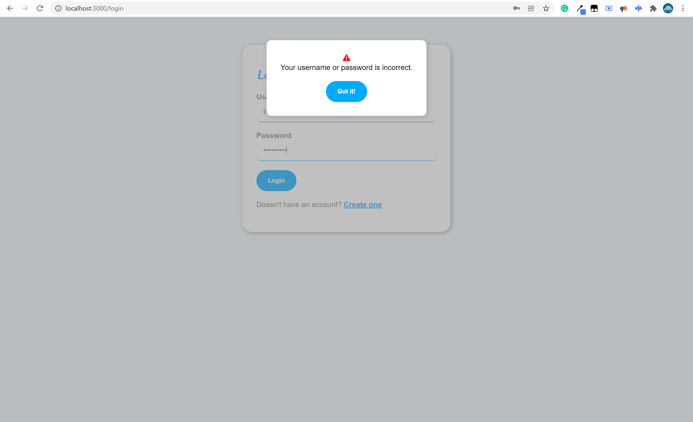

Once the user logs into the account, they will reach the home page. In the homepage, the frontend fetches a list of gift-exchanging events and display them in the order of event dates. 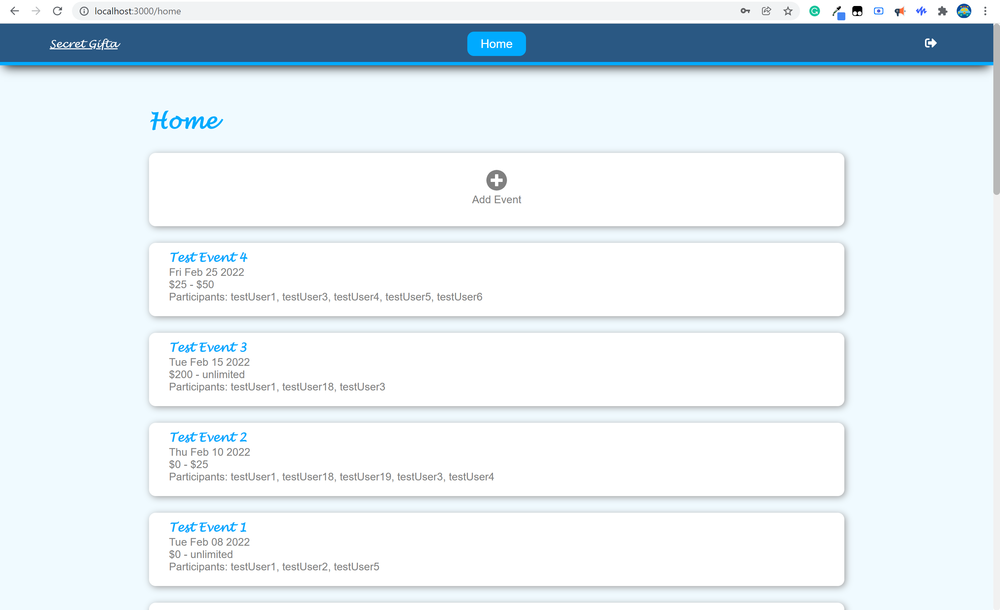

Above the list of events, there is an 'Add' button. Clicking on it brings the user to a form. In this page, users can fill in the event name, date, gift value range, number of gifts each participants will give out, and add participants. 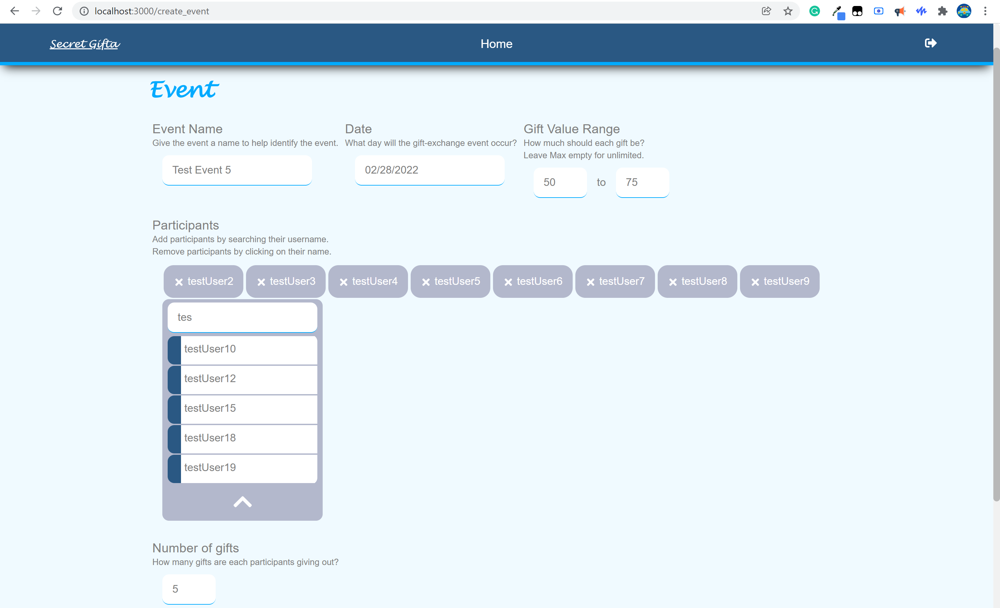

Once all information is filled in and the event is saved, the backend starts matching each participant with at least 1 (based on the number of gifts each participants will give out) other participant(s), and stores the matching pairs into the database. 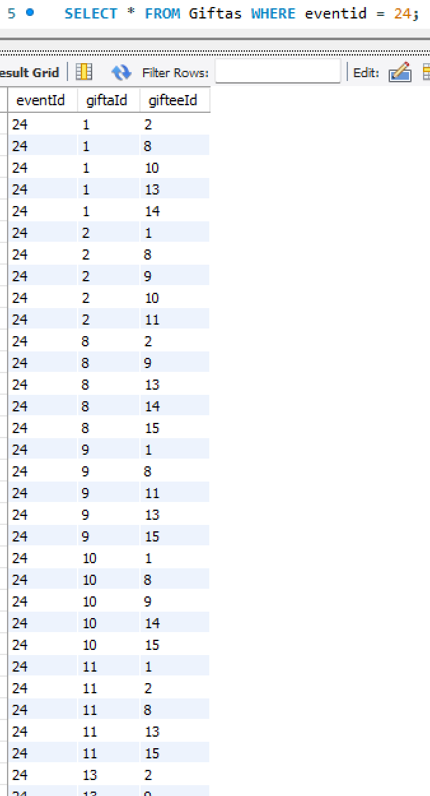

After the event is created, all participants will be able to view this event in their homepage. Clicking in the box brings the user to the detailed page. In this page, the user will be able to view whom they should give gifts to by toggling the button. 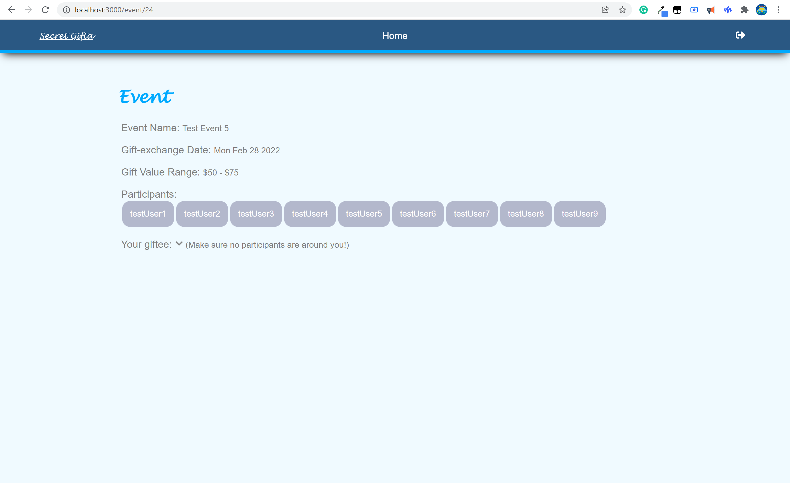 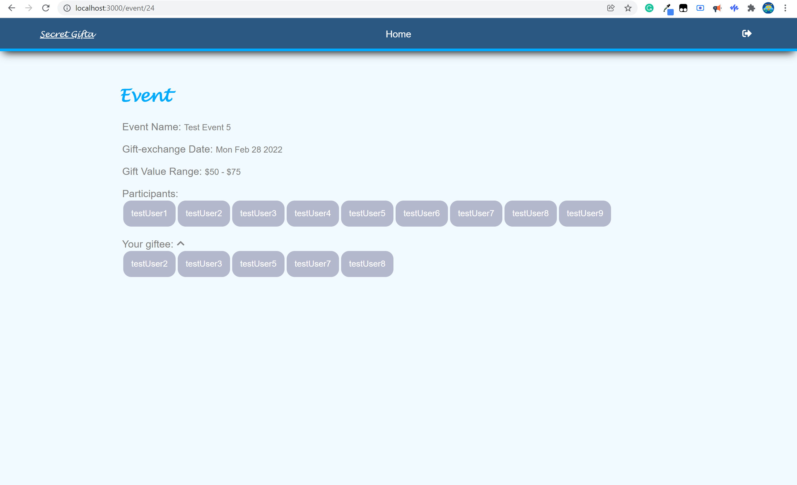

## Some facts about the project
This project uses ReactJS for the frontend, Python for the backend, and mySQL for managing the database. Since it uses ReactJS, it is also a single-page application.

The frontend is responsive. All pages look clean on all kinds of device. 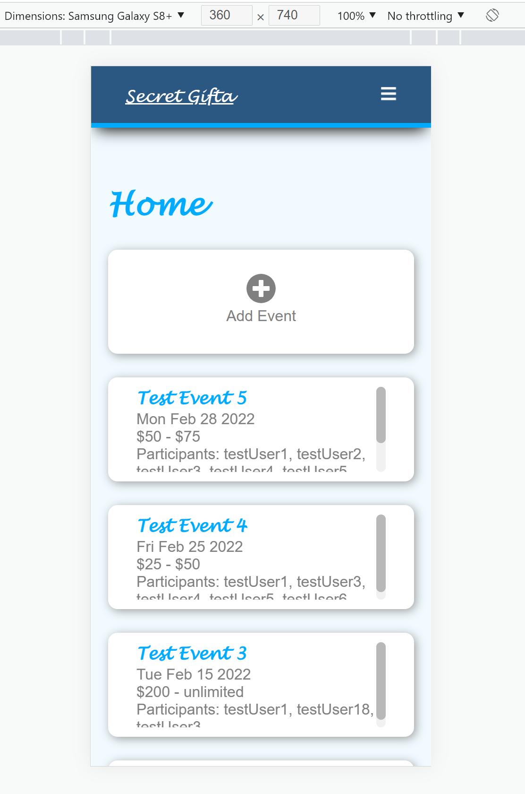 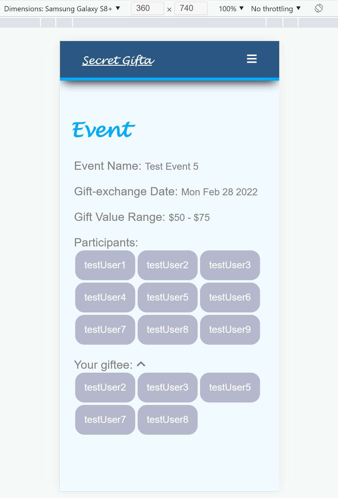 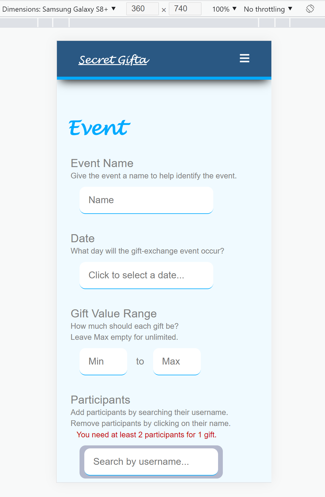

This application uses Formik and Yup to validate user inputs for the register/login/event editing form. All user input errors are displayed clearly near the field. 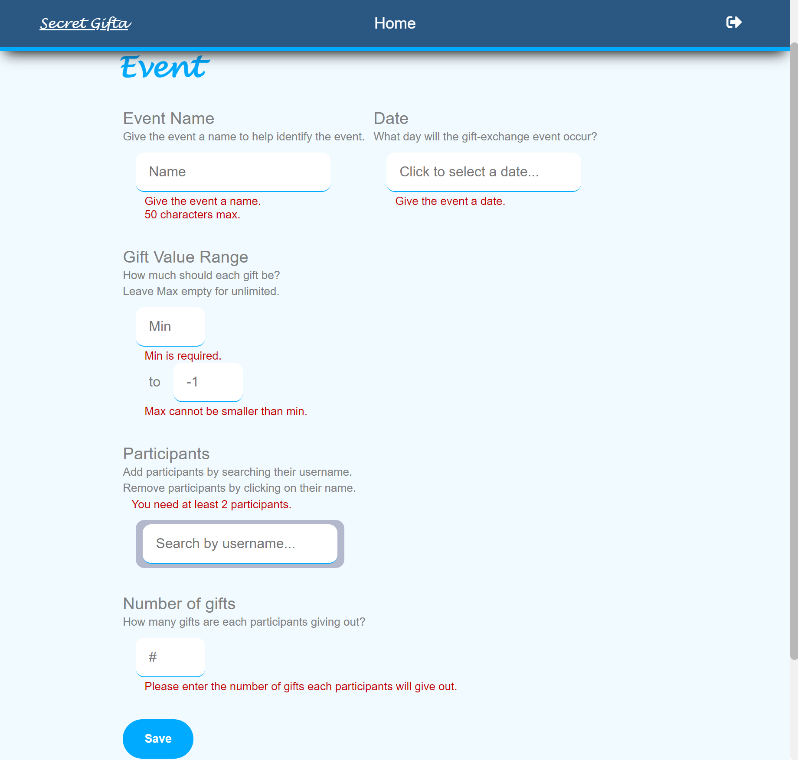 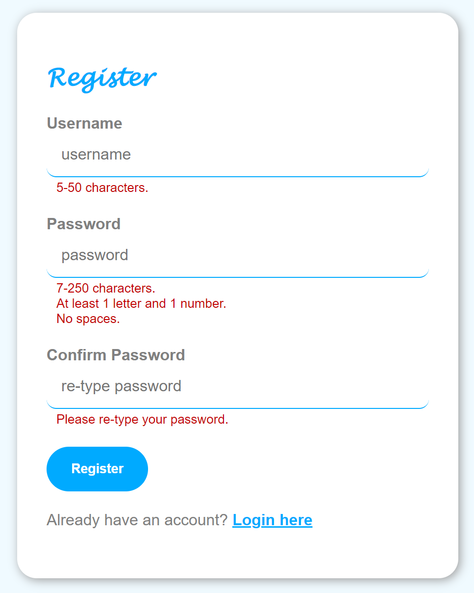

A user-searcher is implemented to assist users while searching for other users. This allow users to search for the others without having to memorize their full username. 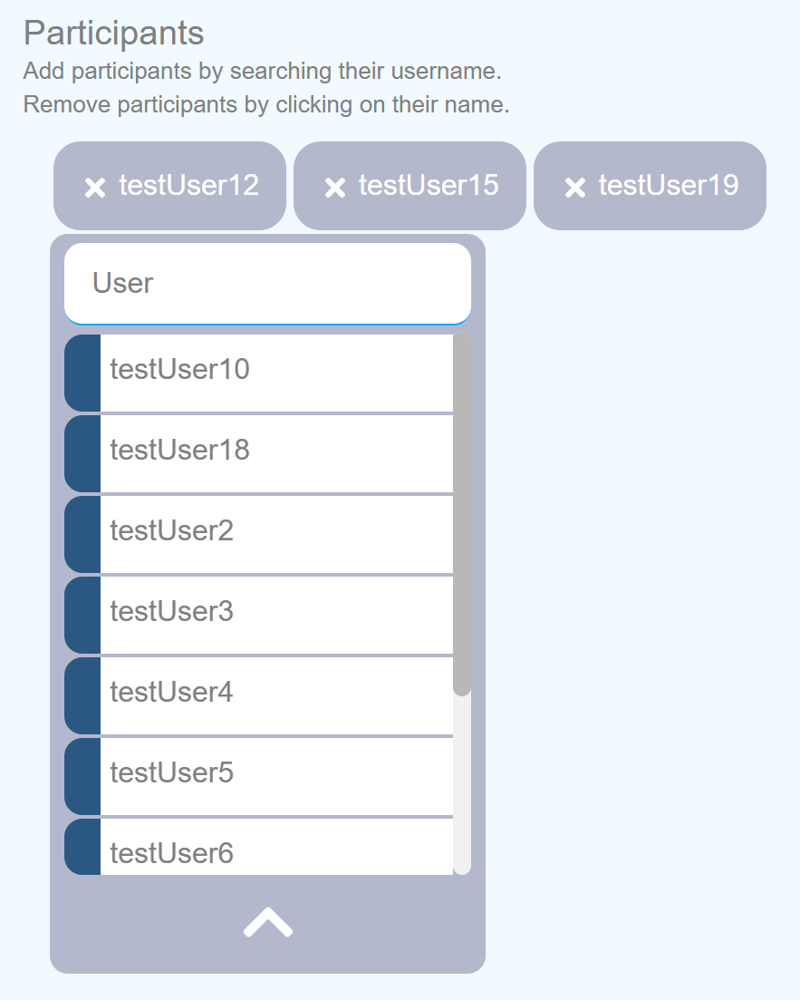

<!-- ## Features in progress

1. friend
   - allow users to connect with other users to form a "friend" relation
   - allow users to create events with other users only if they are "friends"
2. self introduction and wishlist
   - allow users to share some facts about themselves, so users who need to give them gifts will have an idea about what type of gifts to get them -->